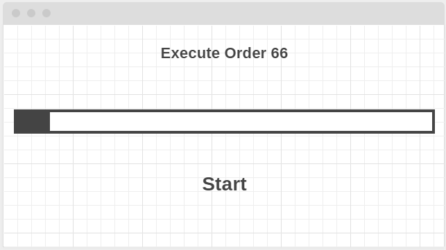

Hello, my name is Sergio, I'm a Software Developer based in Mexico, I consider
myself a self-learner trying new stuff for fun. I've worked on a variety of
projects using different programming languages and platforms.

> _For a TLDR; click here_

## My beginning

I started programming professionally using `C#` and `SQL Server` building
Desktop Applications for `Windows`, it wasn't the best Apps I had ever build,
because most of the time there was just a window with a progress bar and a
centered button with the text _Start_, that when it was pressed it, it executed
a store procedure that will call another set of store procedures and then
updating a _control table_ to handle the progress.

Pretty straightforward with the `C#` code but the store procedures were too
complex for me in 2010. Reading millions of rows from one table, filtering data,
applying data types conversion, creating multiple temporary tables to later use
a big `join` query, and apply business logic and formulas as a result of monthly
sales statistics.

I have to say that SQL Server is really good
it was mostly SQL code.

and a couple of websites with `ASP.net`.
Later migrated completely to the world of Web Development with `PHP` where I had
the opportunity to know more about `Javascript`, `CSS`, `Web Frameworks`, `AJAX`
and by the time, popular front-end libraries and CSS Frameworks like `jQuery`,
`Underscore`, and `Bootstrap`.

Learn `PHP` was awesome, it taught me a lot of how the essentials of the Web
works like `HTTP`, server side-routing, cookies and cache, templates rendering,
exception handling, the famous `MVC Pattern`, SQL Injection,
prepared statements, regular expressions, assets management, a couple of
things about `Web Servers` configuration, and last but not least CLI
programming. Who could know that a programming language with more than 15 years
by the time could teach you all that stuff? That's why every time I use `PHP` I
feel a little nostalgia ❤️ , and yes, I never used a `PHP` framework (but I did
build a simple one), thanks to that is probably why I learned about all this
stuff.

Web Development was easy, then came `node.js` and everything I knew was
ruined 🔥...

Well, not really, but many things that I had never thought of appeared out of
nowhere.

## Have you ever heard about `asynchronous programming`?

No? Well, back then neither did I and it did sucks. `node.js` introduced me the
concept of `callbacks` which _is a function that is passed as an argument to
another function and is expected to be called at a given time_. Easy right? It
really was but after using a bunch of the amazing collection of _async_
functions of node the code started to look a little messy.

I present to you [**The Callback Hell**][callback-hell] 🎊, the one and only
concept that makes your code looks like a vertical pyramid and highlights its
excessive use of the code blocks like this one `(err, cb) => { cb(); }`. I'm not
exagerating, it really looks messy with some files but thankfully for me, one
day I found what was suppoused to be the _Wordpress for node.js_,
[**Ghost**][ghost], some libraries and frameworks started using another
libraries with a new concept for me, _Promises_.

## I promise you I will not be messy...

...And the promise was fulfilled ✨. Learning promises was hard for me, I mean, the concept looks self-explanatory but
it kinda doesn't. Promises helped me avoid the use of `(err, cb) => { cb(); }` but introduced the
`.then().then().catch().finally()` everywhere. When do you have to use `catch` or `finally`? That was the question. It
was really better than callbacks, but still did feel like something's missing. `bluebird`, `q`, `when`.

## How did I get into programming?

## What are my development skills?

[callback-hell]: http://callbackhell.com/
[ghost]: https://ghost.org/
