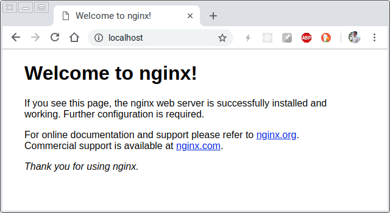

## Introducción

Si has utilizado _docker_ para ejecutar tus aplicaciones web seguramente has accedido a ellas utilizando una URL como https://localhost:3000 porque al momento de crear tu contenedor definiste que el puerto 3000 es el que se utilizará desde el host local el cual es **localhost**.

## Dejar de utilizar _localhost_

Una manera de simular que estamos utilizando una dirección web diferente a _localhost_ es editando el archivo _hosts_ del sistema operativo y agregar un hostname que utilize la dirección IP local _127.0.0.1_.

Para este ejemplo agregaremos el hostname `mi-pagina-local.com` al archivo _hosts_:

```hosts
127.0.0.1  localhost mi-pagina-local.com
::1        localhost
```

Ahora, si accedemos en el navegador web a `mi-pagina-local.com:3000` veremos que nuestra aplicación se está ejecutando.

## Dejar de utilizar el puerto (transparentemente)

Si bien no podemos eliminar ó dejar de utilizar uno de los puertos en la dirección web, si podemos utilizar uno de los puertos predeterminados (80 ó 443) que dependiendo del protocolo que utilizemos (http ó https) se asignará de manera automática al acceder con la URL.

Entonces crearemos ejecutaremos nuestro contenedor utilizando el puerto 80 del equipo local, con esto ahora es posible acceder a nuestra aplicación utilizando la URL `mi-pagina-local.com`.

## Utilizando multiples hostnames

Así como agregamos `mi-pagina-local.com` al archivo _hosts_ también podemos agregar tantos hostnames como queramos, a fin de cuentas todos van a configurarse para utilizar 127.0.0.1, o mejor dicho, con todos los hostnames configurados se accederá al mismo sitio que _localhost_, lo cual a fin de cuentas no sirve de mucho.

```hosts
127.0.0.1  localhost mi-pagina-local.com
::1        localhost

Hostnames personalizados

127.0.0.1   super-pagina.com
127.0.0.1   google-mejorado.com
127.0.0.1   gooogle.com
127.0.0.1   facebook.com.mx
```

## Multiples hostnames, multiples aplicaciones

_¿Pero que pensarias si te dijera que cada uno de los hostnames que configuraste en tu archivo hosts puediera ser utilizado para cada una de tus aplicaciones?_

Pues bien, podemos hacerlo, para ello vamos a utilizar los [servidores virtuales basados en nombres][nginx-name-based-virtual-servers] del servidor web **NGINX**.

Editaremos los archivos de configuración de NGINX para agregar tres configuraciones de tipo servidor:

```nginx.conf
server {
  listen 80;

  server_name node.containers.com;

  location ^~ / {
    roxy_pass http://localhost:3618;
  }
}

server {
  listen 80;

  server_name python.containers.com;

  location ^~ / {
    roxy_pass http://localhost:3620;
  }
}

server {
  listen 80;

  server_name php.containers.com;

  location ^~ / {
    roxy_pass http://localhost:3622;
  }
}
```

Para poder reconocer estos hostnames también necesitaremos agregarlos al archivo _hosts_:

```hosts
127.0.0.1	localhost

# Containers configuration
127.0.0.1	node.containers.com
127.0.0.1	python.containers.com
127.0.0.1	php.containers.com
```

https://github.com/byoigres/example-840f-nginx-docker

## Proxy Pass — o redireccionando la URL —

NGINX permite redireccionar una URL hacia otra...

Primero instalar nginx.

```shell
sudo apt update
sudo apt install nginx
```

Deberás ver lo siguiente en [http://localhost](http://localhost):



```shell
cd /etc/nginx
```

```conf
user www-data;
worker_processes auto;
pid /run/nginx.pid;
include /etc/nginx/modules-enabled/*.conf;

events {
	worker_connections 768;
	# multi_accept on;
}

http {

	##
	# Basic Settings
	##

	sendfile on;
	tcp_nopush on;
	tcp_nodelay on;
	keepalive_timeout 65;
	types_hash_max_size 2048;
	# server_tokens off;

	# server_names_hash_bucket_size 64;
	# server_name_in_redirect off;

	include /etc/nginx/mime.types;
	default_type application/octet-stream;

	##
	# SSL Settings
	##

	ssl_protocols TLSv1 TLSv1.1 TLSv1.2; # Dropping SSLv3, ref: POODLE
	ssl_prefer_server_ciphers on;

	##
	# Logging Settings
	##

	access_log /var/log/nginx/access.log;
	error_log /var/log/nginx/error.log;

	##
	# Gzip Settings
	##

	gzip on;

	# gzip_vary on;
	# gzip_proxied any;
	# gzip_comp_level 6;
	# gzip_buffers 16 8k;
	# gzip_http_version 1.1;
	# gzip_types text/plain text/css application/json application/javascript text/xml application/xml application/xml+rss text/javascript;

	##
	# Virtual Host Configs
	##

	include /etc/nginx/conf.d/*.conf;
	include /etc/nginx/sites-enabled/*;
}


#mail {
#	# See sample authentication script at:
#	# http://wiki.nginx.org/ImapAuthenticateWithApachePhpScript
# 
#	# auth_http localhost/auth.php;
#	# pop3_capabilities "TOP" "USER";
#	# imap_capabilities "IMAP4rev1" "UIDPLUS";
# 
#	server {
#		listen     localhost:110;
#		protocol   pop3;
#		proxy      on;
#	}
# 
#	server {
#		listen     localhost:143;
#		protocol   imap;
#		proxy      on;
#	}
#}
```

[apache]: https://httpd.apache.org/
[nginx]: https://nginx.org/
[host-file-location]: https://en.wikipedia.org/wiki/Hosts_(file)#Location_in_the_file_system
[nginx-name-based-virtual-servers]: https://nginx.org/en/docs/http/request_processing.html
